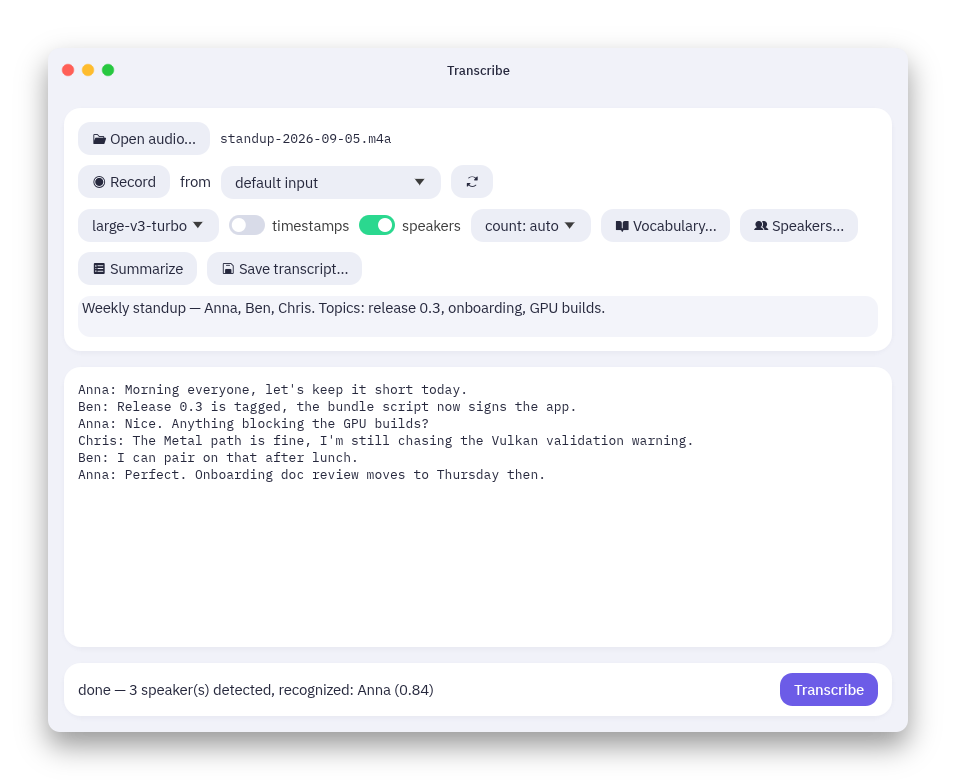

# Transcribe



Local, offline speech-to-text for meetings and recordings. Built on
[whisper.cpp](https://github.com/ggerganov/whisper.cpp) with Metal GPU
acceleration, with speaker detection, voice enrollment (so speakers get real
names), and local transcript summaries. Nothing leaves your machine.

Prebuilt apps for macOS, Linux, and Windows are on the
[releases page](https://github.com/woelper/transcribe/releases). A released
app downloads the models it needs into `~/.transcribe/models` on first use.

## The app

- **Open audio…** loads an mp3, mp4/m4a, wav, flac, or ogg file (decoded in
  Rust via symphonia, no ffmpeg needed), or hit **Record** to capture from
  any audio input device.
- **Model dropdown** switches between whisper models (tiny … large-v3, plus
  distil-large-v3.5 — faster and slightly more accurate than turbo, but
  English-only) and downloads missing ones automatically. large-v3-turbo is
  the default and the best accuracy/speed tradeoff (~19x realtime on an M2
  Pro).
- **timestamps** / **speakers** toggles add `[HH:MM:SS.mmm --> HH:MM:SS.mmm]` prefixes and
  `Speaker N:` labels; the **count:** dropdown pins the number of people in
  the recording, which avoids phantom extra speakers.
- **Context box** for the meeting name, attendees, and topics of the current
  recording — sent to whisper alongside the vocabulary so names and jargon
  are spelled right.
- **Vocabulary…** edits `vocabulary.md`, a permanent list of terms whisper
  should know (see below).
- **Speakers…** enrolls voices so future transcripts label them by name;
  **Rename…** relabels `Speaker 1` in a finished transcript and enrolls that
  voice in one step (see below).
- **Summarize** condenses the transcript with a local Llama model (downloaded
  on first use).
- The transcript is editable in place; **Save transcript…** writes it via a
  file dialog.

### Naming speakers (voice enrollment)

Speaker detection labels voices as `Speaker 1`, `Speaker 2`, … To get real
names, enroll each person once: open **Speakers…**, type the name, and either
record ~10 seconds of them talking naturally or pick an existing recording
with **From audio file…** — optionally with a `from`/`to` time range
(`mm:ss`) pointing at a stretch where only that person speaks, e.g. their
monologue in a meeting recording. The voice fingerprint is stored permanently
in **`speakers.json`** and used by every future transcription — app and CLI —
so whoever's voice matches is labeled by name:

```
[00:01:39.640 --> 00:01:43.280]  Jane: Yeah, that's part of the problem...
```

The easiest enrollment path is after the fact: once a transcript is done, hit
**Rename…**, declare who "Speaker 1" actually is, and Apply — the transcript
is relabeled, and (unless you untick the checkbox) that voice is enrolled
under the new name using its fingerprint from this very recording, so future
transcripts name them automatically.

Re-enrolling the same name replaces that voice. Enrollment quality matters: a
sample recorded with the same mic/setup as your meetings matches best.
Unrecognized voices keep their `Speaker N` numbering. Speaker labels are
reliable for distinct voices and clean turn-taking; heavy crosstalk or very
similar voices can still be confused. Setting the speaker **count** helps
most.

### Vocabulary

The app and the CLI both read **`vocabulary.md`** (editable via the
**Vocabulary…** button) and fold its terms into the whisper prompt, biasing
recognition toward your names and jargon — e.g. listing `Kubernetes` stops it
from being transcribed as "communities". One term per line; markdown
headings, list markers, and `<!-- comments -->` are ignored:

```markdown
## Projects
- Kubernetes
- Grafana

## People
- Jane Doe
```

### Recording system audio (YouTube, Zoom, ...)

macOS doesn't expose "what's playing" as an input device, so capturing system
audio needs a loopback driver such as [BlackHole](https://github.com/ExistentialAudio/BlackHole):

```sh
brew install blackhole-2ch
```

Then in **Audio MIDI Setup**, create a *Multi-Output Device* with both your
speakers/headphones and BlackHole, and set it as the system output (so you
still hear the audio). In the app, pick **BlackHole 2ch** as the recording
device, hit **Record**, play the video/call, then **Stop** and
**Transcribe**.

To capture both sides of a call (their audio *and* your voice), create an
*Aggregate Device* combining BlackHole and your microphone in Audio MIDI
Setup, and record from that instead.

## Building from source

```sh
./download-model.sh                # fetches ggml-large-v3-turbo (~1.6 GB) into models/
./download-diarization-models.sh   # optional: speaker-detection models (~35 MB)
cargo build --release
cargo run --release                # starts the app
```

Other models: `./download-model.sh small` (`tiny`, `base`, `small`, `medium`,
`large-v3`, and `.en` variants). Launch from the repo root so the app finds
`models/`, `vocabulary.md`, and `speakers.json`.

To get a double-clickable **Transcribe.app**, install [cargo-bundle](https://github.com/burtonageo/cargo-bundle)
and run `./bundle.sh` (not `cargo bundle` directly — the script picks the GUI
binary and adds the microphone usage description macOS requires). The app
finds `models/` by searching upward from its own location, so keep it inside
the repo or place a `models/` folder next to it.

## Command line

The same engine is available as a CLI for scripting and batch work:

```sh
./target/release/transcribe recording.mp3                 # transcript to stdout
./target/release/transcribe -o out.txt -t recording.m4a   # to file, with timestamps
./target/release/transcribe -d -t meeting.m4a             # with speaker labels
```

| Flag | Effect |
|---|---|
| `-o <file>` | write transcript to file instead of stdout |
| `-t` | prefix segments with `[HH:MM:SS.mmm --> HH:MM:SS.mmm]` |
| `-d` | detect speakers, prefix segments with `Speaker N:` |
| `-l <lang>` | language code (default `auto`) |
| `-b <n>` | beam search width (slower, slightly more accurate; default greedy) |
| `-m <path>` | model path (default `models/ggml-large-v3-turbo.bin`) |
| `-p <text>` | initial prompt — seed names/jargon or bias output style |
| `--translate` | translate to English |
| `--max-speakers <n>` | cap on distinct speakers for `-d` (default 8) |
| `--speaker-threshold <x>` | voice-similarity cutoff for `-d` (default 0.5); lower merges speakers, higher splits them |

The default initial prompt nudges whisper toward punctuated, capitalized
output (it otherwise tends to lock into an unpunctuated style when a file
starts mid-sentence). Pass `-p "..."` to override it entirely.

Voices can also be enrolled from the command line:
`cargo run --release --example enroll -- sample.m4a "Jane"`.

## Pipeline

1. Decode audio with symphonia (pure Rust)
2. Downmix to mono, resample to 16 kHz (rubato FFT resampler)
3. With speaker detection: diarization (onnxruntime) — pyannote
   segmentation-3.0 splits the audio into speaker turns (including gapless
   handoffs, via the model's per-frame speaker classes), wespeaker CAM++
   embeds each turn as a voice fingerprint, and average-linkage agglomerative
   clustering groups turns into speakers
4. Run whisper.cpp via whisper-rs, Metal-accelerated, greedy decoding with
   temperature fallback
5. With speaker detection: each whisper segment is labeled with the speaker
   whose turns overlap it most

If two speakers get merged, raise `--speaker-threshold`; if one person splits
into several labels, lower it (CLI only; the app's **count** dropdown covers
the common case).

## Releases

`./release.sh [major|minor|patch|X.Y.Z]` bumps the version in Cargo.toml,
commits, and creates an annotated tag whose body is an AI-generated
changelog (via the `claude` CLI; falls back to the raw commit list).
Pushing the tag (`git push origin HEAD --follow-tags`) triggers a GitHub
Actions workflow that builds macOS (Transcribe.app, arm64), Linux, and
Windows artifacts and attaches them to a [release](https://github.com/woelper/transcribe/releases)
whose notes are taken from the tag body. Only macOS gets Metal
acceleration; the other targets run whisper on CPU.
